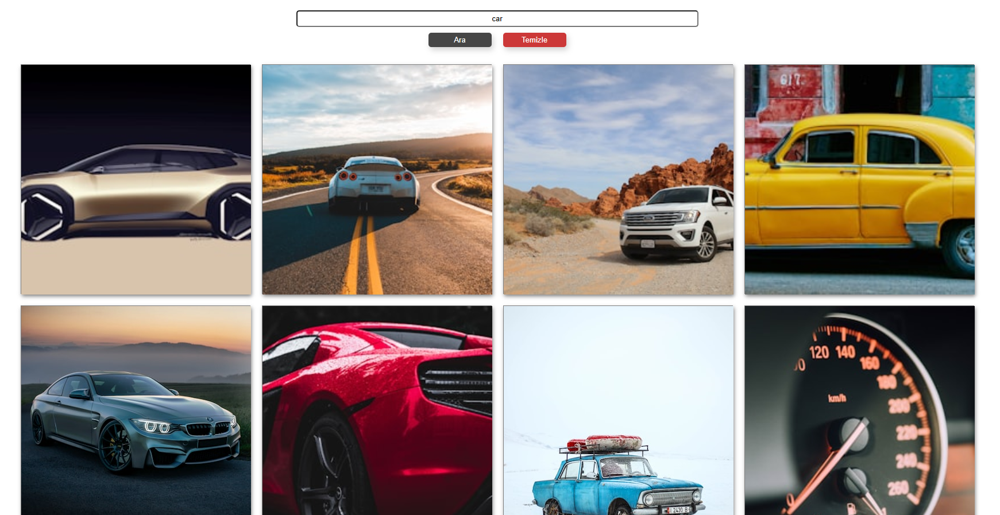

# Unsplash Görsel Arama Uygulaması

Bu proje, [Unsplash](https://unsplash.com/developers) API'si kullanılarak belirli bir kelimeye göre görselleri arayıp kullanıcıya gösteren basit bir JavaScript uygulamasıdır.

## 🚀 Özellikler

- Unsplash API üzerinden görsel arama
- Girilen kelimeye göre ilgili görsellerin listelenmesi
- Arama geçmişinin temizlenmesi
- Responsive tasarım desteği (isteğe bağlı geliştirilebilir)

## 🧰 Kullanılan Teknolojiler

- HTML
- CSS
- Vanilla JavaScript
- Unsplash API

## 📸 Ekran Görüntüsü




## 🔧 Kurulum

1. Bu repoyu indir ya da klonla:

```bash
git clone https://github.com/uyuryusuf/search-images.git
```
